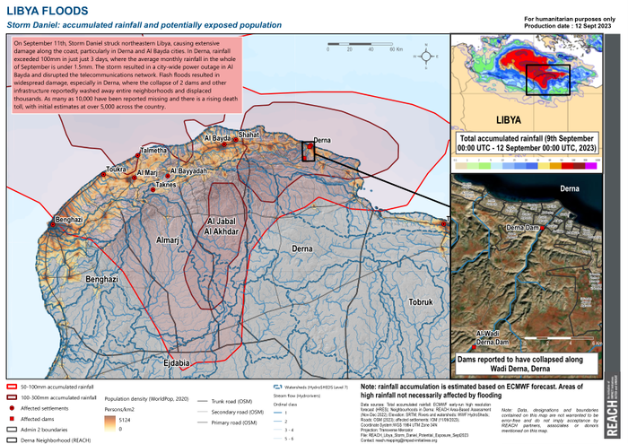
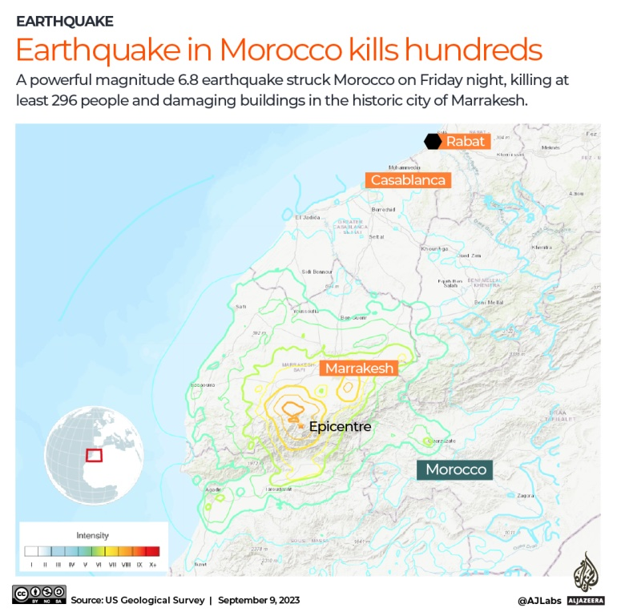

# Emergency mapping

Here we describe and research the applications of AI tools to Earth observation imagery to empower the early response to disaster and assist in emergency mapping. Links to the open datasets are collected and updated here.

## Libya flooings

### Important updates ###

| Region | Description - what? how? | URL | Application / Format| Updated |
|-------------|------------|----------|----------|-------------|
| Derna | Building footprints of Derna area extracted from Mapbox Satellite basemaps | 👉 [download](https://filebrowser.mapflow.ai/s/pyHW6qlI38h8cX4) | GeoJSON | [x] 2023-09-14 |

## Morocco earthquake ##

### Important updates ###

| Region | Description - what? how? | URL | Application / Format| Updated |
|-------------|------------|----------|----------|-------------|
| Marrokesh | Building footprints of Marrakesh area extracted from the ArcGIS Worldview imagery basemaps | 👉 [download](https://filebrowser.mapflow.ai/s/6o2ZssFy7CrrAS5) | GeoJSON | [x] 2023-09-10 |

## Turkey and Syria earthquakes ##

### Important updates ###

| Region | Description - what? how? | URL | Application | Updated |
|-------------|------------|----------|----------|-------------|
| Turkey | Connect all Maxar's images to QGIS XYZ layers | [download](Turkey/XYZ_links_Opendata_Maxar_Turkey.xml) | QGIS / Mapflow-QGIS | |
| Turkey | QGIS collaborative project | [download](Turkey/project-qgis.xml) | QGIS / Mapflow-QGIS | [x] 2022-02-17 |

## Imagery ##

### Maxar Open data ###

The data is published under the open license (CC BY-NC 4.0) and available on the [Open data program website](https://www.maxar.com/open-data/turkey-earthquake-2023).
At Geoalert we published all the data using our tile server to make it more interoperable for GIS applications, like QGIS, Openstreetmap editors, etc. 

> **_NOTE:_** Any imagery or data distributed through the Open Data Program is licensed under the CC BY-NC 4.0. This licensing allows for noncommercial use of the information, meaning it can quickly be integrated into first responder workflows with organizations like Team Rubicon, the Red Cross and other nonprofits.

### How to access the new images in QGIS ###

The Openaerialmap community members are consolidating all open imagery on a single map. You can find images from SkySat (by Planet) and WorldView (by Maxar).
Each image can be added to QGIS using TMS link.
Mapflow QGIS plugin can be used to run building detection and mapping on basemaps and new imagery. See more detailed description in the Mapflow [user guides](https://docs.mapflow.ai/userguides/howto.html#use-openaerialmap-as-an-imagery-publication-tool).

## Mapping contribution

If you are an OpenStreetMap contributor, you can use this data to contribute to OSM directly or accelerate your own mapping efforts. Since the data was generated automatically, it should be thoroughly validated before import. You can preview and edit the data using QGIS, the OSM ID editor ("custom Map Data"), or JOSM. We also strongly recommend that you check [OSM imports community guidelines](https://wiki.openstreetmap.org/wiki/Import/Guidelines).
We've created the Open Urban Mapping [wiki](https://wiki.openstreetmap.org/wiki/Geoalert_Open_Urban_Mapping) - you can find some tips on editing and doing imports based on our datasets.

The auto-mapping approach can also be used to help create maps from scratch in times of **emergencies**, so we appreciate any contribution and/or related data requests.

If you'd like to help us with documentation, integration of datasets into third-party applications like JOSM, RapID, etc., or promote this project, please check out the [issues](https://github.com/Geoalert/urban-mapping/issues) or create one to submit your request. You can also contact us directly at [hello@geoalert.io](mailto:hello@geoalert.io)

## References

* [Openaerialmap - Turkey region](https://map.openaerialmap.org/#/36.80351257324219,37.14991863100135,10?_k=ggl1wi)
* [Mapflow QGIS plugin](https://github.com/Geoalert/mapflow-qgis)
---------------------------